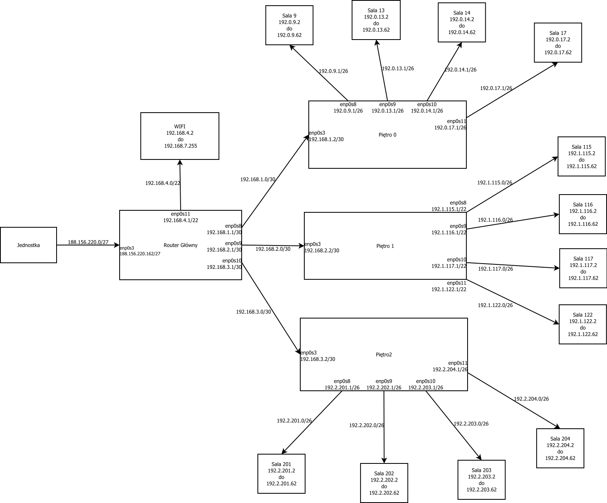

## Zadanie 12:

  ### Ustalenie adresów:
  
  - Sieć główna : 188.156.220.160/27
  
  Sieć | Adres | Maska
  ---|---|---
  ||
  G-P0 | 192.168.1.0 | 255.255.255.252 (/30)
  G-P1 | 192.168.2.0 | 255.255.255.252 (/30)
  G-P2 | 192.168.3.0 | 255.255.255.252 (/30)
  WIFI | 192.168.4.0 | 255.255.252.0 (/22)
  ||
  P0-S1 | 192.0.9.0 | 255.255.255.192 (/26)
  P0-S13 | 192.0.13.0 | 255.255.255.192 (/26)
  P0-S14 | 192.0.14.0 | 255.255.255.192 (/26)
  P0-S17 | 192.0.17.0 | 255.255.255.192 (/26)
  ||
  P1-S115 | 192.1.115.0 | 255.255.255.192 (/26)
  P1-S116 | 192.1.116.0 | 255.255.255.192 (/26)
  P1-S117 | 192.1.117.0 | 255.255.255.192 (/26)
  P1-S122 | 192.1.122.0 | 255.255.255.192 (/26)
  ||
  P2-S201 | 192.2.201.0 | 255.255.255.192 (/26)
  P2-S202 | 192.2.202.0 | 255.255.255.192 (/26)
  P2-S203 | 192.2.203.0 | 255.255.255.192 (/26)
  P2-S204 | 192.2.204.0 | 255.255.255.192 (/26)
  
  ### 2. Dodawanie adresów:
  
  Nazwa Routera | Karta sieciowa | Adres | Maska
  ---|---|---|---
  ||
  Router Główny | enp0s3 | 188.156.220.162 | 255.255.255.224 (/27)
  Router Główny | enp0s8 | 192.168.1.1 | 255.255.255.252 (/30)
  Router Główny | enp0s9 | 192.168.2.1 | 255.255.255.252 (/30)
  Router Główny | enp0s10 | 192.168.3.1 | 255.255.255.252 (/30)
  Router Główny | enp0s11 | 192.168.4.1 | 255.255.252.0 (/22)
  ||
  Piętro 0 | enp0s3 | 192.168.1.2 | 255.255.255.252 (/30)
  Piętro 0 | enp0s8 | 192.0.9.1 | 255.255.255.192 (/26)
  Piętro 0 | enp0s9 | 192.0.13.1 | 255.255.255.192 (/26)
  Piętro 0 | enp0s10 | 192.0.14.1 | 255.255.255.192 (/26)
  Piętro 0 | enp0s11 | 192.0.17.1 | 255.255.255.192 (/26)
  ||
  Piętro 1 | enp0s3 | 192.168.2.2 | 255.255.255.252 (/30)
  Piętro 1 | enp0s8 | 192.1.115.1 | 255.255.255.192 (/26)
  Piętro 1 | enp0s9 | 192.1.116.1 | 255.255.255.192 (/26)
  Piętro 1 | enp0s10 | 192.1.117.1 | 255.255.255.192 (/26)
  Piętro 1 | enp0s11 | 192.1.122.1 | 255.255.255.192 (/26)
  ||
  Piętro 2 | enp0s3 | 192.168.3.2 | 255.255.255.252 (/30)
  Piętro 2 | enp0s8 | 192.2.201.1 | 255.255.255.192 (/26)
  Piętro 2 | enp0s9 | 192.2.202.1 | 255.255.255.192 (/26)
  Piętro 2 | enp0s10 | 192.2.203.1 | 255.255.255.192 (/26)
  Piętro 2 | enp0s11 | 192.2.204.1 | 255.255.255.192 (/26)
  
  - Dla każdego urządzenia i każdej karty modyfikujemy plik **/etc/network/interfaces**, 
    np. dla Routera Głównego i enp0s3:  
     **auto enp0s3  
      iface enp0s3 inet static  
      adress 188.156.220.162  
      netmask 255.255.255.224**
   
   #### DHCP:
  
   Nazwa Routera | Karta | Adres | Maska | Zakres | Adres routera
   ---|---|---|---|---|---
   ||
   Router Główny | enp0s11 | 192.168.4.0 | 255.255.252.0 (/22) | 192.168.4.2 do 192.168.7.255 | 192.168.4.1
   ||
   Piętro 0 | enp0s8 | 192.0.9.0 | 255.255.255.192 (/26) | 192.0.9.2 d0 192.0.9.62 | 192.0.9.1
   Piętro 0 | enp0s9 | 192.0.13.0 | 255.255.255.192 (/26) | 192.0.13.2 d0 192.0.13.62 | 192.0.13.1
   Piętro 0 | enp0s10 | 192.0.14.0 | 255.255.255.192 (/26) | 192.0.14.2 d0 192.0.14.62 | 192.0.14.1
   Piętro 0 | enp0s11 | 192.0.17.0 | 255.255.255.192 (/26) | 192.0.17.2 d0 192.0.17.62 | 192.0.17.1
   ||
   Piętro 1 | enp0s8 | 192.1.115.0 | 255.255.255.192 (/26) | 192.1.115.2 do 192.1.115.62 | 192.1.115.1
   Piętro 1 | enp0s9 | 192.1.116.0 | 255.255.255.192 (/26) | 192.1.116.2 do 192.1.116.62 | 192.1.116.1
   Piętro 1 | enp0s10 | 192.1.117.0 | 255.255.255.192 (/26) | 192.1.117.2 do 192.1.117.62 | 192.1.117.1
   Piętro 1 | enp0s11 | 192.1.122.0 | 255.255.255.192 (/26) | 192.1.122.2 do 192.1.122.62 | 192.1.122.1
   ||
   Piętro 2 | enp0s8 | 192.2.201.0 | 255.255.255.192 (/26) | 192.2.201.2 do 192.2.201.62 | 192.2.201.1
   Piętro 2 | enp0s9 | 192.2.202.0 | 255.255.255.192 (/26) | 192.2.202.2 do 192.2.202.62 | 192.2.202.1
   Piętro 2 | enp0s10 | 192.2.203.0 | 255.255.255.192 (/26) | 192.2.203.2 do 192.2.203.62 | 192.2.203.1
   Piętro 2 | enp0s11 | 192.2.204.0 | 255.255.255.192 (/26) | 192.2.204.2 do 192.2.204.62 | 192.2.204.1
  
   - Dla każdego urządzenia w pliku **/etc/default/isc-dhcp-server** należy odkomentować 
      ścieżkę do pliku **config DHCPDv4_CONF** oraz dla każdej karty dopisać 
      **INTERFACESv4="(nazwa lub nazwy kart)"** np. **INTERFACESv4="enp0s8 enp029 enp0s10 enp0s11"** dla Piętro 0
  
   - Dla każdej karty należy osobno dodać konfigurację zgodnie z tabelką w pliku **/etc/dhcp/dhcpd.conf**
    np. dla Router główny i enp0s3:  
    **subnet 192.168.4.0 netmask 255.255.252.0 {  
          range 192.168.4.2 do 192.168.7.255;  
          option routers 192.168.4.1;  
          option domain-name-servers 1.1.1.1, 1.0.0.1;  
        }  
      systemctl restart isc-dhcp-server**
      
  ### 3. Przekazywanie pakietów oraz routing:

  - na wszystkiech routerach odkomentować **net.ipv4.ip_forward=1**
    w pliku **/etc/sysctl.d/99-sysctl.conf** aby włączyćprzekazywanie pakietów

  - na każdym PC z tabeli poniżej dodajemy  w pliku **/etc/network/interfaces**
    komendę **up ip route add default via (ADRES)** wstawiając ADRES zgodnie z tabelą

    PC | Adres
    ---|---
    ||
    Router Główny | 188.156.220.162
    PC z WIFI | 192.168.4.1
    Piętro 0 | 192.168.1.1
    PC z sali 9/13/14/17 na 0 piętrze | 192.0.9/13/14/17.1
    Piętro 1 | 192.168.2.1
    PC z sali 115/116/117/122 na 1 piętrze | 192.1.115/116/117/122.1
    Piętro 2 | 192.168.3.1
    PC z sali 201/202/203/204 na 2 piętrze | 192.2.201/202/203/204.1
    
    ### 4. Reguła masquerade:
    
    - W każdym routerze dopisujemy reguły
      **iptables -t nat -A POSTROUTING -s (ADRES) -o enp0s3 -j MASQUERADE**
      (w tym przypadku zawsze dla karty enp0s3)
      zgodnie z tabelą poniżej oraz zapisujemy je wpisując komendę 
      **sudo sh -c "iptables-save > /etc/iptables.rules"** i dodajemy 
      **post-up iptables-restore < /etc/iptables.rules** w 
      **/etc/network/interfaces** aby zostały wczytane po restarcie
      
      Router | Adres
      ---|---
      ||
      Router Główny | 192.168.1.0/30
      Router Główny | 192.168.2.0/30
      Router Główny | 192.168.3.0/30
      Router Główny | 192.168.4.0/22
      ||
      Piętro 0 | 192.0.9.0/26
      Piętro 0  | 192.0.13.0/26
      Piętro 0  | 192.0.14.0/26
      Piętro 0  | 192.0.17.0/26
      ||
      Piętro 1  | 192.1.115.0/26
      Piętro 1  | 192.1.116.0/26
      Piętro 1  | 192.1.117.0/26
      Piętro 1  | 192.1.122.0/26
      ||
      Piętro 2  | 192.2.201.0/26
      Piętro 2  | 192.2.202.0/26
      Piętro 2  | 192.2.203.0/26
      Piętro 2  | 192.2.204.0/26
      
      ## Diagram:
      

  
