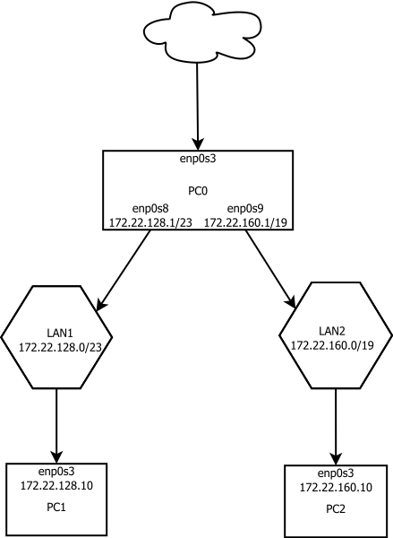

## Zadanie 8:
  ### 1. Ustalenie adresów:
  
  Sieć | Adres | Maska
  ---|---|---
  LAN1 | 172.22.128.0| 255.255.254.0 (/23)
  LAN2 | 172.22.160.0| 255.255.224.0 (/19)
  
  
  ### 2. Dodawanie adresów:
  
  PC | Karta sieciowa | Adres | Maska
  ---|---|---|---
  PC0 | enp0s8 | 172.22.128.1 | 255.255.254.0 (/23)
  PC0 | enp0s9 | 172.22.160.1 | 255.255.224.0 (/19)
  PC1 | enp0s8 | 172.22.128.10 | 255.255.254.0 (/23)
  PC2 | enp0s8 | 172.22.160.10 | 255.255.224.0 (/19)
  
  - adresy dodajemy modyfikując plik **/etc/network/interfaces**, np. dla PC0 i enp0s8:  
    **auto enp0s8  
      iface enp0s8 inet static  
      adress 172.22.128.1  
      netmask 255.255.254.0**
    
  
  ### 3. Przekazywanie pakietów oraz routing:
  
  - Aby włączyć przekazywanie pakietów na PC0 w pliku **/etc/sysctl.d/99-sysctl.conf** 
    włączamy linijkę **net.ipv4.ip_forward=1** 
    
  - Aby włączyć routing dodajemy w pliku **/etc/network/interfaces** komendę 
    **up ip route add default via 172.22.128.1** na PC1 i odpowiednio 
    **up ip route add default via 172.22.160.1** na PC2
   
 ### 4. Reguła masquerade:
 
  - Na PC0 wpisujemy następujące komendy aby dodać reguły:
    * **iptables -t nat -A POSTROUTING -s 172.22.128.0/23 -o enp0s3 -j MASQUERADE**
    * **iptables -t nat -A POSTROUTING -s 172.22.160.0/19 -o enp0s3 -j MASQUERADE**
  - Komendę **sudo sh -c "iptables-save > /etc/iptables.rules"** aby je zapisać
  - Oraz dopisujemy **post-up iptables-restore < /etc/iptables.rules** w 
    **/etc/network/interfaces** aby zostały wczytane po restarcie
 ### 5. DNS:
 
  - w **/etc/resolv.conf** dopisujemy **nameserver 1.1.1.1**
    
## Diagram:

